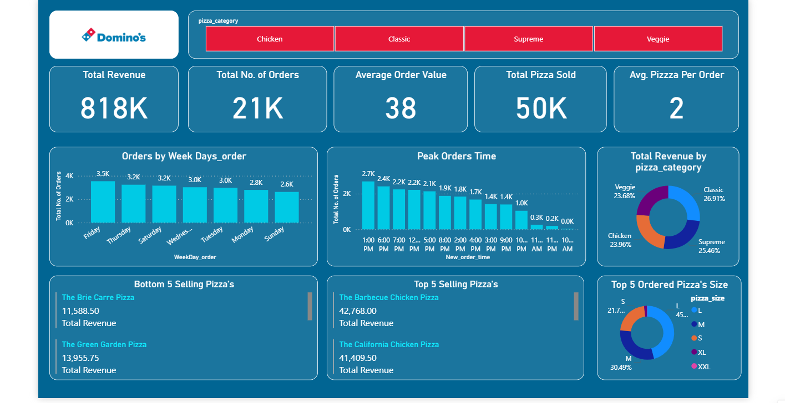

# Domino's Pizza Sales Dashboard | Power BI Project

An interactive and visually appealing sales analysis dashboard created using *Power BI* to gain insights into Domino's Pizza sales performance, customer behavior, and product trends.

---

## 📊 Dashboard Overview

This Power BI report highlights:

- *Total Revenue:* ₹818K
- *Total Orders:* 21K
- *Total Pizzas Sold:* 50K
- *Average Order Value:* ₹38
- *Avg. Pizzas per Order:* 2

Key insights include:
- Orders by weekday and time of day
- Top and bottom selling pizzas
- Revenue by pizza category
- Most popular pizza sizes

---

## 📁 Project Structure

DashboardsProject/ │ ├── Dashboard.png            # Screenshot of the Power BI Dashboard ├── Domino's.xlsx            # Raw dataset containing pizza order details ├── dominos.pbix             # Power BI report file (editable and interactive) ├── Dominos-logo.png         # Domino’s brand logo used in the report └── Used formula.txt         # DAX formulas and calculated measures used in Power BI

---

## 🖼 Dashboard Screenshot

---

## ⚙ Tools & Technologies

- *Power BI Desktop*
- *Microsoft Excel*
- *DAX (Data Analysis Expressions)*

---

## 🚀 Getting Started

To view or edit the dashboard:

1. Clone or download the repository.
2. Open dominos.pbix in *Power BI Desktop*.
3. If required, update the dataset source path to Domino's.xlsx.
4. Explore the visuals and KPIs interactively.

---

## 👨‍💻 Author

- *Name:* Mohit  
- *Role:* Data Analyst | Dashboard Developer  
- *Purpose:* Portfolio Project / Practice

---

## 📄 License

This project is open for educational and portfolio use only. Not affiliated with Domino’s.

---
